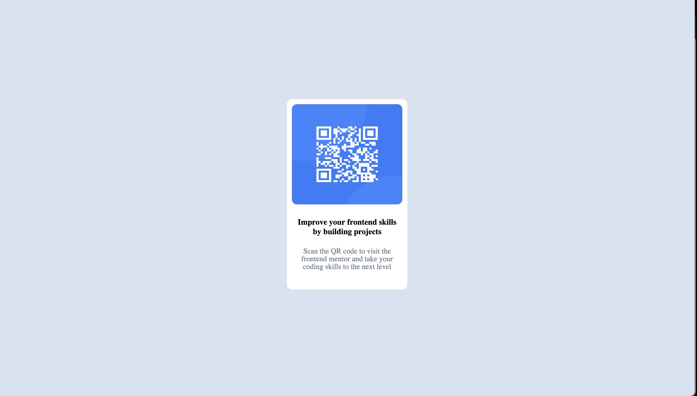

# Frontend Mentor - QR code component solution

This is a solution to the [QR code component challenge on Frontend Mentor](https://www.frontendmentor.io/challenges/qr-code-component-iux_sIO_H). Frontend Mentor challenges help you improve your coding skills by building realistic projects. 

## Table of contents

- [Overview](#overview)
  - [Screenshot](#screenshot)
  - [Links](#links)
- [My process](#my-process)
  - [Built with](#built-with)
  - [What I learned](#what-i-learned)
  - [Continued development](#continued-development)
  - [Useful resources](#useful-resources)
- [Author](#author)


**Note: Delete this note and update the table of contents based on what sections you keep.**

## Overview

### Screenshot



### Links

## My process

### Built with

- HTML5
- CSS3
- Worked with div, centering the div, aligning content

**Note: These are just examples. Delete this note and replace the list above with your own choices**

### What I learned

```css
margin: auto;
translate: transformY(50%);
```

### Continued development

incorporate feedback that is received and continue to iterate over.


### Useful resources

- google


## Author

pavan